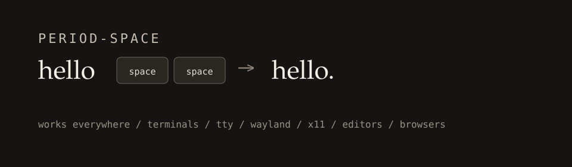

<p align="center">
  
</p>

<h1 align="center">period-space</h1>

<p align="center">
  The macOS “double-space adds a period” habit, on Linux.<br>
  <strong>It works everywhere</strong> — terminals, TTY, Wayland, X11, editors, browsers.
</p>

<p align="center">
  <a href="LICENSE"></a>
  
  
</p>

---

Linux never shipped the macOS / iOS setting. Compositor tweaks and editor plugins only cover one app. **period-space** remaps the key *before* the desktop sees it, so the same double-tap works in Ghostty, vim, Firefox, niri, GNOME, a raw TTY — anywhere the keyboard works.

```
hello<space><space>    →    hello.
```

The first Space is a Space. A second Space within 400ms becomes `. `. Wait longer and you just get two spaces. Ctrl / Alt / Super + Space stay shortcuts.

## Works everywhere

This is the whole point. The mapping is not a GNOME extension, not a terminal setting, and not an IME trick.

| Place | Works |
| --- | --- |
| Terminals (Ghostty, Kitty, Alacritty, foot, …) | Yes |
| TTY / login console | Yes |
| Wayland (niri, Hyprland, Sway, GNOME, KDE, …) | Yes |
| X11 | Yes |
| Editors (Cursor, VS Code, vim, emacs, …) | Yes |
| Browsers and GUI apps | Yes |

If the keyboard can type there, double-space can put a period there.

## Install

```bash
git clone https://github.com/hapwi/period-space.git
cd period-space
./install.sh
```

`./install.sh` copies the `period-space` command to `~/.local/bin`, writes a user config if you do not have one, installs [keyd](https://github.com/rvaiya/keyd) on Fedora or Arch if needed, and turns the mapping on. It stays on after reboot.

Needs `sudo` once so keyd can own the keyboard device.

## Use

```bash
period-space on        # enable (also what install.sh does)
period-space off       # disable, leave keyd installed
period-space status    # see if it is active
period-space reload    # apply config edits
```

Type a word, tap Space twice quickly. You should get a period and a space.

If the keyboard ever locks up, hold **Backspace + Escape + Enter** to kill keyd.

## Config

Your copy is `~/.config/period-space/keyd.conf`. Edit it, then run `period-space reload`.

```ini
[global]
oneshot_timeout = 400
```

Raise that number if you type slowly. Lower it if a casual double-space is turning into a period when you did not want one.

If a mouse, headset, or gamepad starts eating keys, it is advertising a keyboard interface. Find the id, then exclude it:

```bash
keyd monitor
```

```ini
[ids]
*
-1532:007d
```

## How it works

`period-space` is a small controller. **[keyd](https://github.com/rvaiya/keyd)** is the always-on program.

1. The first Space is emitted and a short-lived layer is armed.
2. If the next key is Space before the timeout, keyd sends Backspace, `.`, Space.
3. That consumes the layer. A third Space is just another Space.

Because this happens on the input device, every program sees the finished `. `.

## License

[MIT](LICENSE)
