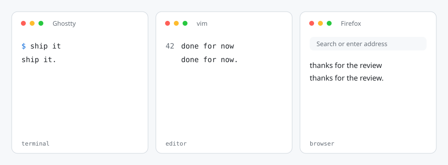

<p align="center">
  <picture>
    <source media="(prefers-color-scheme: dark)" srcset="assets/logo-dark.svg">
    
  </picture>
</p>

<p align="center">
  <b>Double-space → period. On Linux. Everywhere.</b>
</p>

<p align="center">
  <picture>
    <source media="(prefers-color-scheme: dark)" srcset="assets/keys-dark.svg">
    
  </picture>
</p>

<p align="center">
  <a href="#install">Install</a>
  ·
  <a href="#update">Update</a>
  ·
  <a href="#commands">Commands</a>
  ·
  <a href="#configuration">Configuration</a>
  ·
  <a href="#how-it-works">How it works</a>
</p>

<p align="center">
  <a href="LICENSE"></a>
  
  
  <a href="https://github.com/rvaiya/keyd"></a>
</p>

<p align="center">
  <picture>
    <source media="(prefers-color-scheme: dark)" srcset="assets/demo-dark.svg">
    
  </picture>
</p>

Same habit as iOS and macOS: tap Space twice quickly after a word and you get a period.

This is not a GNOME extension, a terminal setting, or an editor plugin. **period-space** remaps the key at the device level with [keyd](https://github.com/rvaiya/keyd), so every program sees the finished `. `.

Ghostty, vim, Firefox, niri, GNOME, KDE, a raw TTY — if you can type there, it works there. Ctrl / Alt / Super + Space are left alone.

## Install

No fork. No clone. One command:

```bash
curl -fsSL https://hapwi.github.io/install/period-space.sh | bash
```

It downloads the CLI, writes a user config if you do not have one, installs [keyd](https://github.com/rvaiya/keyd) on Fedora or Arch if needed, and turns the mapping on. It asks for `sudo` once so keyd can own the keyboard.

Python 3 and sudo are required. After it finishes, `~/.local/bin` needs to be on your `PATH`.

<details>
<summary>From a local clone</summary>

```bash
git clone https://github.com/hapwi/period-space.git
cd period-space
./install.sh
```

</details>

<details>
<summary>Other distros</summary>

Install [keyd](https://github.com/rvaiya/keyd) yourself, then rerun the curl command. The installer will skip the package step and only set up period-space.

</details>

## Update

```bash
period-space update
```

Pulls the latest CLI and bundled defaults from GitHub. Your `~/.config/period-space/keyd.conf` is never overwritten. If the mapping is on, keyd is reloaded.

## Commands

| Command | What it does |
| --- | --- |
| `period-space on` | enable the mapping |
| `period-space off` | disable it (keyd stays installed) |
| `period-space status` | is it active? |
| `period-space reload` | apply config edits |
| `period-space update` | fetch the latest from GitHub |

Type a word, tap Space twice. You should get `word. `.

If the keyboard ever locks up, hold **Backspace + Escape + Enter** to kill keyd.

## Configuration

User config: `~/.config/period-space/keyd.conf`. Edit it, then run `period-space reload`.

```ini
[global]
oneshot_timeout = 400
```

Raise the timeout if you type slowly. Lower it if accidental double-spaces are becoming periods.

If a mouse, headset, or gamepad starts eating keys, it is advertising a keyboard interface. Find the id and exclude it:

```bash
keyd monitor
```

```ini
[ids]
*
-1532:007d
```

## How it works

`period-space` is a small controller. **keyd** is the always-on program.

1. The first Space is emitted and a short-lived layer is armed.
2. If the next key is Space before the timeout, keyd sends Backspace, `.`, Space.
3. That consumes the layer. A third Space is just another Space.

Because this happens on the input device, the compositor, the terminal, and the TTY all see the same `. `.

## Uninstall

```bash
period-space off
rm -f ~/.local/bin/period-space
```

keyd is left in place in case you use it for anything else.

## License

[MIT](LICENSE)
